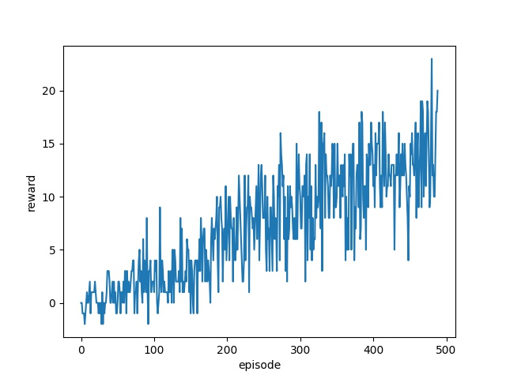

# Reinforcement Learning: Navigation Project
## Code
There are five python files in the project repo:
* `model.py`: contains the code specifying the backbone neural network structure.

* `dqn_agent.py`: contains the core code of TD-learning of the DQN.

* `common.py`:   contains code for initializing and playing in the banana environement.

* `train.py`: contains the code for training the DQN agent. To launch the code, use 

            python train.py dqn_fname
    
    The last parameter `dqn_fname` is the name of the file where the trained agent to be stored.

* `test.py`: contains the code to play the banana environment, either randomly or with a trained DQN agent. To launch the code:

            python test.py dqn_fname

    The last parameter `dqn_fname` is optional. If it is given, the code will play the trained agent stored in that file, otherwise the code will play the environment randomly.

## Learning Algorithm
### Network Structure
The backbone neural network is a feedforward neural network with two hidden layers. 
* **Input layer**: The input to the neural network is the current state in the banana environment, which is a 37 dimensional vector.
* **Hidden layers**: There are two hidden layers. Both have 64 neurons.
* **Output layer**:  The output is the Q-scores correpsonding to the input state. Therefore the output is a 4-dimensional vector, which is the same as the number of possible actions.

### Training Algorithm
There are several comoponents in the training algorithm:

1. **Replay Buffer**. This is a `deque` buffer recording the playing experiences. Each record is a **experience tuple** `(S, A, R, S', done)` consists of `state`, `action`, `reward`, `next_state` and `done` of the environment. The agent plays according to current neural network parameters. After every certain steps, a batch of experience tuples are randomly sampled from the replay buffer, which are then used to update the neural network parameters. 

2. **TD Learning**. The TD learning algorithm is used to update the neural netork parameters. Namely, we hope for each experience tuple `(S, A, R, S', done)`, the Q score `Q(S, A)` can be closed to the following TD-target
    
        TD-target = R + GAMMA * max_a Q(S', a) * (1-done) 
    where `GAMMA` is the discount parameter.

3. **Fixed Q-Targets**. Since both target and current Q sores are calculated with DQN, to make the training process stable, two DQNs are used in the training process. In particular, the following upate rule is used for the experience tuple `(S, A, R, S', done)`:

        delta_w=lr * (TD-target -Q(S,A,w))*grad_w Q(S,A,w)
    where,

        TD-target = R + GAMMA * max_a Q(S', a, w_) * (1-done)

    where w_ are the weights of a separate target network that are not changed during the learning step. And this target network are updated after the each learning step. Details can be seen in the `soft_update` funtion in `dqn_agent.py`.

## Results
### Training
To launch the training code, please run 

    python train.py dqn-fname

The last parameter `dqn-fname` is the name of the file where the trained agent will be stored.

As can be seen from the recores, the environment can be solved at the 488th training episode.

**Plot of rewards**

### Test
To play with trained agent, please run:

    python test.py dqn-fname

The last parameter `dqn-fname` is the name of the file where the trained agent is stored. The code will play the environment with this saved agent. If this parameter is not given, then the code will play randomly. At the end, the score is displayed. 

It can be seen that a score of 18 has been obtained during the test run.